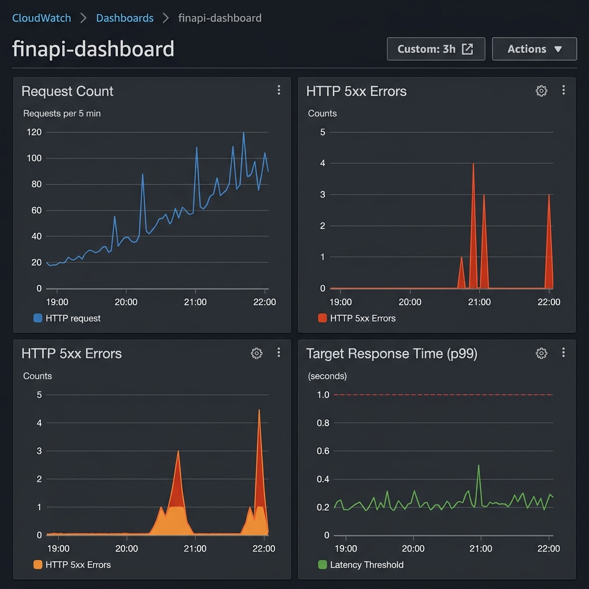

# Exercise 9.2 — FinAPI CloudWatch Dashboard

**Course:** Optimizaciones y Desempeño — Cloud Deployment Automation
**Session:** 9 — June 18, 2026

---

## Overview

This repository extends the Exercise 9.1 observability module by adding a **CloudWatch Dashboard** (`finapi-dashboard`) that gives the on-call team a single-pane-of-glass view of request volume, error rate, and latency — without navigating across multiple CloudWatch pages.

## Repository Structure

```
oyd-exercise-9-2/
├── versions.tf                         # Terraform & provider version constraints
├── main.tf                             # Root module — instantiates observability module
├── variables.tf                        # Root input variable declarations
├── outputs.tf                          # Root outputs (dashboard_url, SNS ARN, log group)
├── envs/
│   └── dev/
│       └── dev.tfvars                  # Dev environment variable values
├── evidence/
│   └── dashboard.png                   # Screenshot of the deployed dashboard
└── modules/
    └── observability/
        ├── main.tf                     # All resources: log group, SNS, alarms, dashboard
        ├── variables.tf                # Module input variables
        └── outputs.tf                  # Module outputs including dashboard_url
```

## Dashboard Widgets

| # | Widget Title | Type | Metric | Stat | Period |
|---|---|---|---|---|---|
| 1 | Request Count | metric | `AWS/ApplicationELB / RequestCount` | Sum | 300 s |
| 2 | HTTP 5xx Errors | metric | `AWS/ApplicationELB / HTTPCode_Target_5XX_Count` | Sum | 300 s |
| 3 | Target Response Time (p99) | metric | `AWS/ApplicationELB / TargetResponseTime` | p99 | 300 s |

All metric widgets reference Terraform expressions (`var.alb_arn_suffix`) — no hardcoded ARN strings or account IDs.

## Usage

### 1. Prerequisites

- AWS CLI configured with valid credentials
- Terraform >= 1.6
- ALB ARN suffix and confirmed SNS email subscription from Exercise 9.1

### 2. Configure variables

Edit `envs/dev/dev.tfvars` and replace the placeholder values:

```hcl
alb_arn_suffix     = "app/<your-alb-name>/<hex-id>"
notification_email = "your-email@example.com"
```

### 3. Apply

```bash
terraform init
terraform apply -var-file="envs/dev/dev.tfvars"
```

### 4. Generate traffic & view dashboard

```bash
# Generate 30 requests (replace with your ALB DNS name)
for i in $(seq 1 30); do curl -s -o /dev/null http://<YOUR-ALB-DNS>/; done

# Wait 2–3 minutes, then retrieve the dashboard URL
terraform output dashboard_url
```

Open the URL in your browser to confirm the dashboard loads with live data.

## Evidence



## Existing Resources (from Exercise 9.1)

| Resource | Description |
|---|---|
| `aws_cloudwatch_log_group.app` | `/finapi/dev` log group (14-day retention) |
| `aws_sns_topic.alerts` | `finapi-alerts` SNS topic |
| `aws_cloudwatch_metric_alarm.http_5xx` | Alerts when 5xx count ≥ 5 over 2 periods |
| `aws_cloudwatch_metric_alarm.latency` | Alerts when avg latency ≥ 1 s over 2 periods |
| `aws_cloudwatch_metric_alarm.estimated_charges` | Daily billing alarm (us-east-1 provider) |
| `aws_budgets_budget.monthly` | Budget guard — alerts at 80% of monthly cap |